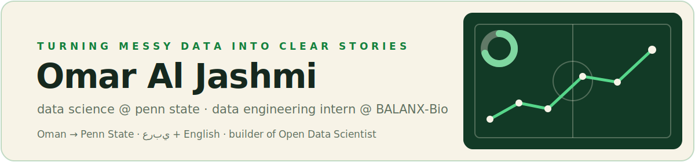

<p align="center">
  
</p>

<h2 align="center">Hey, I'm Omar</h2>

<p align="center"><em>Data is the foundation; optimization is the architecture.</em></p>

<p align="center">
  <a href="https://omaraljashmi.github.io"></a>
  <a href="https://open-data-scientist-omar.streamlit.app"></a>
  <a href="https://www.linkedin.com/in/omar-al-jashmi/"></a>
  <a href="mailto:omaraljashmi.uni@gmail.com"></a>
</p>

---

### The short version

I'm a Data Science student at **Penn State** (Economics minor, class of 2027), originally from **Oman**. I got here on a national scholarship that roughly 50,000 students compete for — which still feels a little surreal — and I've been trying to earn it ever since: **3.86 GPA, Dean's List all six semesters** — streak intact.

By day I'm a **Data Engineering Intern on the AI team at BALANX-Bio**, building dashboards and pipelines that keep four research and operations workflows honest. By night I build my own tools — usually because a spreadsheet annoyed me enough to do something about it.

```text
what I care about: data you can trust · charts that show their math · tools anyone can afford
```

### What I'm building right now

**[Open Data Scientist](https://github.com/omaraljashmi/data-insight-studio)** — my favorite project. Upload a messy CSV and it profiles it, cleans it (with an undo button and receipts), builds dashboards, writes SQL for you, coaches your SQL, and ships the data wherever you want. Three rules I refuse to break:

1. **Zero cost** — no paid APIs, ever. Free tiers and local tools only.
2. **Show the math** — every single chart carries the exact audit table behind it.
3. **Your data stays yours** — even the optional AI advisor only ever sees column names, never your values.

Try it in 10 seconds: **[live demo](https://open-data-scientist-omar.streamlit.app)** — click *Try sample dataset*.

Also on the bench: **[Water Out of Reach](https://github.com/omaraljashmi/water-out-of-reach)** — an interactive world map of the places where clean water is hardest to reach, because some datasets deserve more than a bar chart.

### Projects I'm proud of

| Project | The human version |
|---|---|
| **[Water Out of Reach](https://github.com/omaraljashmi/water-out-of-reach)** | An interactive world map of the 37 countries where at least 1 in 5 people lack basic drinking water (WHO/UNICEF data). Tap a country for the numbers, the solutions that fit, and an independently rated way to give. Next.js + TypeScript. |
| **Fake Review Detection** | Taught a model to smell fake reviews — TF-IDF + Logistic Regression + Naive Bayes over ~40,000 of them, **86.7% mean accuracy** across five random seeds (because one lucky seed proves nothing). |
| **Cold Email Sales Analysis** | Turned a pile of outreach data into Clay + Airtable dashboards that actually answer "when should we hit send?" |
| **F1 2021 Season Analysis** | Settled the Hamilton vs. Verstappen argument the only way I know how: in R, with plots. (The data had opinions.) |
| **Job Application Tracker** | An Excel system with dashboards, logs, follow-ups, and templates — job hunting is a data problem too. |

### The toolbox

<p>
  
  
  
  
  
  
  
  
  
  
  
</p>

### Off the keyboard

- Directed a **$60,000 Omani National Day celebration** for 500+ people — traditional artists, diplomats, government officials, and exactly one very stressed spreadsheet of logistics (mine).
- I run operations for **ASEEL at Penn State**, helping Arab students find their footing academically and professionally.
- I dream in Arabic, debug in English.

### The obligatory stats

<p align="center">
  
  
</p>

---

<p align="center">
  <sub>Pitch green &amp; cream — like everything I build. If you've read this far, we should probably talk: <a href="mailto:omaraljashmi.uni@gmail.com">omaraljashmi.uni@gmail.com</a></sub>
</p>
