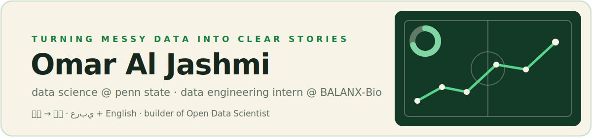

  

## Hi, I'm Omar Al Jashmi 👋

I am a Data Science student at Penn State, minoring in Economics, who enjoys using data, automation, and technology to optimize processes and solve real problems.

### About Me

- 🎓 B.S. in Data Science with a minor in Economics at The Pennsylvania State University
- 📅 Expected graduation: May 2027
- 📊 GPA: 3.86/4.00 and Dean's List for all six semesters
- 💼 Data Engineering Intern on the AI Team at BALANX-Bio
- 🌎 Based in State College, Pennsylvania
- 🗣️ Native Arabic speaker and fluent in English

### What I'm Working On

At **BALANX-Bio**, I build analytics dashboards, support data pipelines, prepare reliable data for downstream analysis, and review shared code. My work improves visibility across four key AI research and operations workflows.

### Featured Projects

#### Fake Review Detection

Built an NLP classification pipeline using TF-IDF, Logistic Regression, and Naive Bayes on approximately 40,000 reviews. The models achieved **86.7% mean accuracy** across five random seeds.

#### Cold Email Sales Data Analysis

Organized and analyzed outreach data using Clay and Airtable. Built automated dashboards to identify patterns in outreach timing, response rates, and meeting conversion.

#### F1 2021 Season Data Analysis

Used R and RStudio to compare Lewis Hamilton and Max Verstappen across race results, performance trends, and their contributions to team success during the 2021 Formula 1 season.

#### Job Application Tracker

Created an Excel-based job search system with an application dashboard, application and networking logs, weekly reviews, follow-up tracking, dropdown controls, and reusable email templates.

### Leadership and Achievement

- Directed a **$60,000-funded Omani National Day celebration** for more than 500 attendees, featuring traditional artists and welcoming diplomats and government officials.
- Earned an Omani national scholarship after competing among approximately 50,000 students.
- Lead operations for ASEEL at Penn State, supporting Arab students through academic, professional, and industry-focused programs.

### Technical Toolkit

**Languages:** Python, R, SQL  
**Libraries:** Pandas, NumPy, scikit-learn  
**Tools:** Git, GitHub, Excel, Airtable, VS Code, RStudio  
**Areas:** Data engineering, machine learning, NLP, automation, dashboards, data cleaning, and statistical analysis

### Connect With Me

